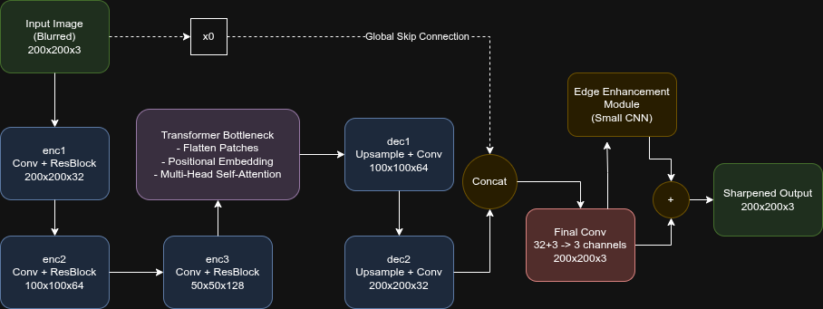

# TikhoFormer: A Classification-Guided Framework for Image Deblurring

This repository contains the official implementation of the **Classification-Guided TikhoFormer**, a novel two-stage framework for efficient and specialized image deblurring. Our approach first identifies the blur type (Gaussian or Box) and then deploys a specialized, lightweight deblurring network to achieve high-quality results with a fraction of the computational cost of monolithic models.

## Architecture Overview

The core of our method is a two-stage pipeline:

1.  **Stage 1: Feature-Based Classifier:** A lightweight Multi-Layer Perceptron (MLP) that operates on a compact 10-dimensional feature vector to accurately and rapidly classify the blur type.
2.  **Stage 2: TikhoFormer Deblurring Network:** A hybrid CNN-Transformer U-Net architecture that acts as a specialist, with one model trained exclusively for Gaussian blur and another for Box blur.

<p align="center">
  
  <br>
  <em>Fig 1. Detailed schematic of the TikhoFormer deblurring network.</em>
</p>

## Key Features

-   **Two-Stage Expert System:** Instead of a "one-size-fits-all" model, our framework classifies the problem first and then dispatches an expert, leading to better specialized performance.
-   **Efficient Feature-Based Classifier:** The blur classifier avoids using a heavy CNN on raw pixels. Instead, it uses a highly efficient MLP on a carefully engineered feature set (Laplacian variance, Fourier energy, HOG statistics), making the classification step extremely fast.
-   **Lightweight Hybrid Deblurring Network (TikhoFormer):** A U-Net architecture that combines the local feature extraction power of CNNs with the global context modeling of a Transformer bottleneck.
-   **High Efficiency:** The entire deployable system, including the classifier and *both* specialist deblurrers, contains only **1.33M parameters**, making it a practical alternative to large SOTA models.

## Setup and Installation

1.  **Clone the repository:**
    ```bash
    git clone https://github.com/mukulboro/TikhoFormer.git
    cd TikhoFormer
    ```

2.  **Create a virtual environment (recommended):**
    ```bash
    python -m venv venv
    source venv/bin/activate 
    ```

3.  **Install the dependencies:**
    ```bash
    pip install -r requirements.txt
    ```

4.  **Download the dataset:**
    -   Download the **Flickr30k Images** dataset.
    -   Unzip and place the contents into the `data/flickr30k_images/` directory. The structure should look like `data/flickr30k_images/1000092795.jpg`, etc.

## How to Use: Running the Notebooks

The entire pipeline is demonstrated in two Jupyter notebooks. Please run them in order.

## Performance and Results

### Classifier Performance

The feature-based classifier achieves high accuracy with extremely low latency.

| Metric             | Score  |
| ------------------ | :----: |
| **Test Accuracy**  | 92.54% |
| **F1-Score**       | 0.9260 |
| **ROC AUC**        | 0.9819 |
| **PR AUC**         | 0.98   |

### Deblurring Performance Comparison

Our complete two-stage framework provides a highly competitive trade-off between performance and efficiency.

| Method                    | Parameters (M) | PSNR (dB) | SSIM   |
| ------------------------- | :------------: | :-------: | :----: |
| SRN                       | 5.30           | 29.23     | 0.93   |
| DeblurGAN-v2              | 11.40          | 28.55     | 0.92   |
| MIMO-UNet+                | 23.90          | 30.93     | 0.95   |
| Uformer                   | 51.70          | 32.84     | 0.96   |
| Restormer                 | 26.10          | **32.92** | 0.96   |
| **TikhoFormer (Ours)**    | **1.33**       | 27.77     | **0.98** |


## Citation
_Waiting for the work to be published_ 
<!-- ## Citation

If you use this work in your research, please consider citing:

```bibtex
@article{YourLastName2023TikhoFormer,
  title={Classification-Guided TikhoFormer: A Detailed Two-Stage Framework for Specialized Image Deblurring},
  author={Your Name, et al.},
  journal={arXiv preprint arXiv:XXXX.XXXXX},
  year={2023}
}
``` -->

## License

This project is licensed under the MIT License. See the [LICENSE](LICENSE) file for details.

## Acknowledgments
- The [Flickr30k](http://shannon.cs.illinois.edu/DenotationGraph/) dataset.
- The development teams of [PyTorch](https://pytorch.org/), [scikit-learn](https://scikit-learn.org/), and [OpenCV](https://opencv.org/).
